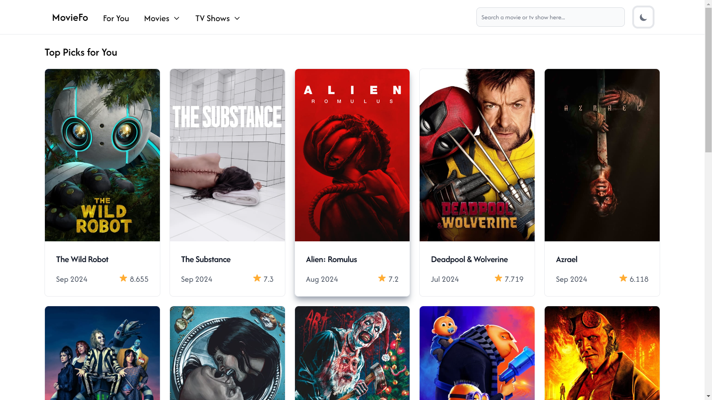
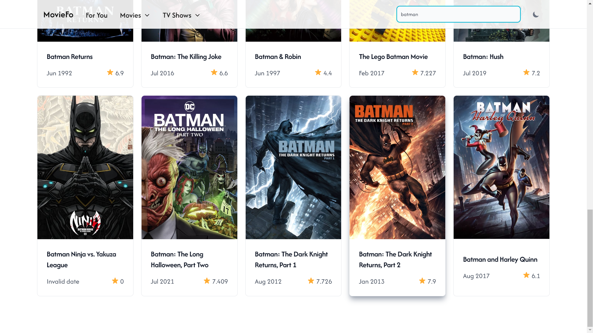
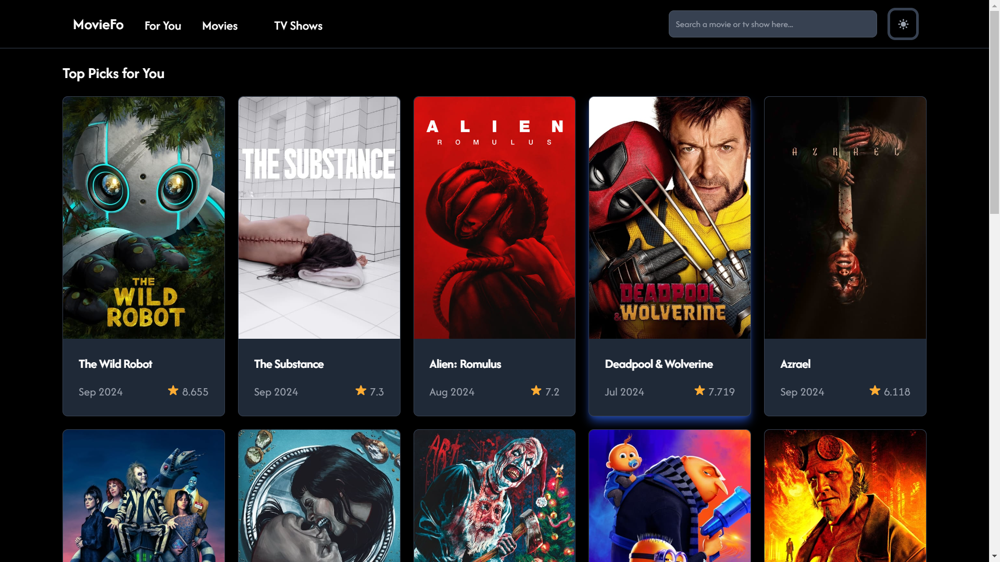

# MovieFo App

This project was made with ReactJs

## API Docs

[https://developer.themoviedb.org] The Movie Database (TMDB) API
Configure the .env file with your API key.
\*Note: You must sign up to obtain an API key first.

## Available Scripts

In the project directory, you can run:

### `npm start`

Runs the app in the development mode.\
Open [http://localhost:3000](http://localhost:3000).

The page will reload automatic when you make changes.\

### `npm run build`

Builds the app for production to the `build` folder.\

### `npm i react-toggle`

Installs React Toggle, a lightweight toggle switch component that can be used to enable or disable functions in React applications.

### `npm install -D tailwindcss postcss autoprefixer`

Installed Framework Tailwind CSS along with PostCSS and Autoprefixer as development dependencies.

### `npx tailwindcss init -p`

For create Tailwind CSS (tailwind.config.js) and PostCSS (postcss.config.js) configuration files automatically, to organize and customize projects with Tailwind.

### `npm install flowbite-react`

Installs Flowbite React, a UI component library based on Tailwind CSS, making it easier to build responsive and modern user interfaces in a React application.

### `npm install moment --save`

Installs Moment.js, a library used to manipulate, format, and display dates and times in the application.

### `npm i axios`

Installs Axios, a promise-based HTTP library used for making HTTP requests (GET, POST, PUT, etc.) from a React application to a server or API.

## Screenshoot

